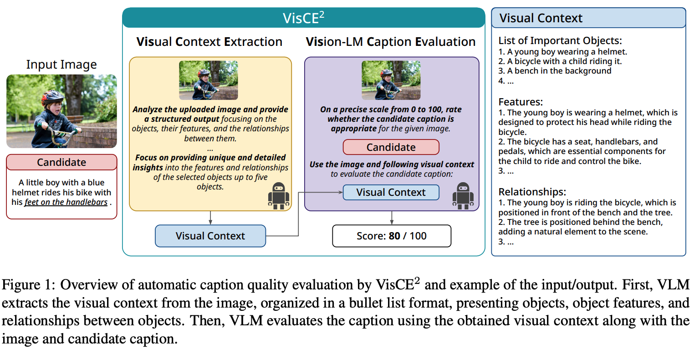

# README

## VisCE^2

This page contains the benchmark dataset for the paper [Vision Language Model-based Caption Evaluation Method Leveraging Visual Context Extraction](https://arxiv.org/abs/2402.17969)

We presents VisCE$^2$, a vision language model-based caption evaluation method.
Our method focuses on visual context, which refers to the detailed content of images, including objects, attributes, and relationships.
By extracting and organizing them into a structured format, we replace the human-written references with visual contexts and help VLMs better understand the image, enhancing evaluation performance.
Through meta-evaluation on multiple datasets, we validated that VisCE2 outperforms the conventional pre-trained metrics in capturing caption quality and demonstrates superior consistency with human judgment.



## Dataset Preparation

### Flickr 8k-Expert, Flickr8k-CF

- Download Flickr 8k Dataset from this [link](https://drive.google.com/drive/folders/1oQY8zVCmf0ZGUfsJQ_OnqP2_kw1jGIXp) .

### Composite

- Download Flickr 8k Dataset from this [link](https://drive.google.com/drive/folders/1oQY8zVCmf0ZGUfsJQ_OnqP2_kw1jGIXp) .

> [!TIP]
> You may have completed this in downloading Flickr8k-Expert dataset.

- Download Flickr 30k Dataset from Kaggle or other link. You can also download from huggingface.datasets .
- Download MSCOCO val2014 dataset from [link](https://cocodataset.org/#download) and choose [2014 Val images](http://images.cocodataset.org/zips/val2014.zip).
- Download annotation files from Dropbox link, located in their [landing page](https://imagesdg.wordpress.com/image-to-scene-description-graph/)

### PASCAL-50S

> [!TIP]
> Currently unavailable. Wait for more informations.

<!-- - Run `wget https://filebox.ece.vt.edu/~vrama91/CIDEr_miscellanous/cider_datasets.tar` and `tar -xvzf {file_name}`.
- Follow `notebooks/prepare_pascal50s.ipynb` and make dataset for the inference. -->

### THumB 1.0

- Download MS-COCO val2014 dataset.

> [!TIP]
> You may have completed this in downloading Composite dataset.

- Clone THumB repository from [GitHub](https://github.com/jungokasai/THumB).

## Usage

- Clone this repository.

```bash
git clone git@github.com:Silviase/VisCE2.git
cd VisCE2
```

- Run the evaluation script. If needed, set ```CUDA_VISIBLE_DEVICES``` to specify the GPU.
- The script will output the evaluation results in ```results/eval/{dataset_id}/{model_id}/{eval_results_file_name}.json```.
- If necessary, modify ```scripts/sample.sh``` for evaluation.

```bash
CUDA_VISIBLE_DEVICES=1 python src/eval.py \
    --dataset_id=flickr8k-expert \
    --model_id=liuhaotian/llava-v1.5-7b \
    --prompt_path=prompts/base.txt \
    --split=0 \
    --result_key=score_model \
    --eval_results_file_name=sample \
    --use_cand \
    --debug
```

## Others

### Contact

If you have any questions, please contact Koki Maeda (```koki.maeda \[at-mark-without-space\] nlp.c.titech.ac.jp```).
You also feel free to create an issue on this repository.

### Citation

```bibtex
@misc{maeda2024vision,
      title={Vision Language Model-based Caption Evaluation Method Leveraging Visual Context Extraction},
      author={Koki Maeda and Shuhei Kurita and Taiki Miyanishi and Naoaki Okazaki},
      year={2024},
      eprint={2402.17969},
      archivePrefix={arXiv},
      primaryClass={cs.CV}
}
```
